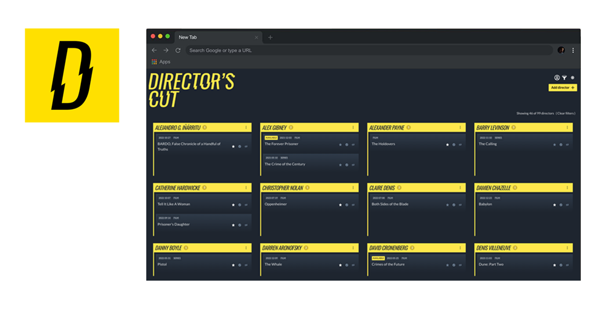
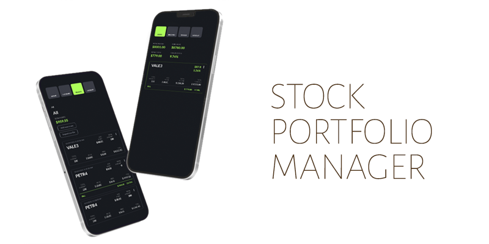

<h1 align="left"> About me </h1>

I've always been a technology enthusiast and since high school (technician in Computer Programming) I've been working on personal projects and developing my tech skills. 
I've customized Wordpress websites using PHP, designed simple IOT devices for my home using Arduino and esp8266 with custom 3d printed cases and built python scrapers and simple apps to optimize tasks like searching for an airline ticket or investment options.

Lately I've been focusing on Backend Development. (Python/Django and also NodeJs)

I've worked as a professional photographer for the past 13 years working in SP and abroad, for magazines and brands from Brazil and internationally.

Now I've decided it is time for me to chase new adventures and follow my other passion working as a software developer.

<h1 align="left" style="margin-top:50px"> Recent projects on github </h1>
<section align="left" style="margin-bottom:50px">

</section>

<h1 align="left" style="margin-top:50px"> Backend </h1>
<section align="left" style="margin-bottom:50px">
  
    
     
  
  
   
  
   

</section>

<h1 align="left"> Frontend </h1>
<section align="left" style="margin-bottom:50px">
  
  
    
</section>

<h1 align="left"> Databases </h1>
<section align="left"  style="margin-bottom:50px">
  
  
</section>

<h1 align="left"> Testing </h1>
<section align="left" style="margin-bottom:50px">
  
  
    
 
</section>

<h1 align="left"> Extras </h1>
<section align="left"  style="margin-bottom:50px">
  
   
  
   
   
    

</section>

<h1 align="left"> Contact </h1>
<section align="left"> 
 	  
  
</section>

 
